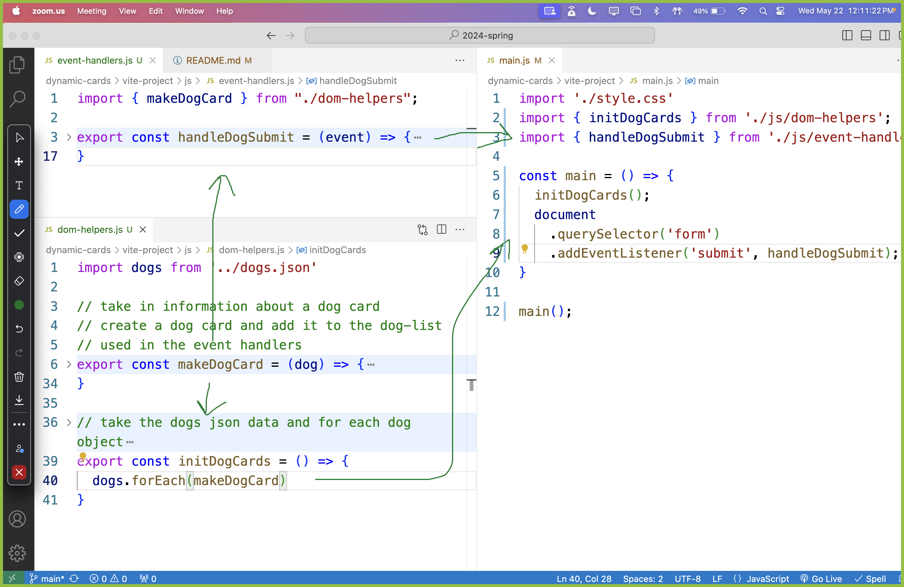
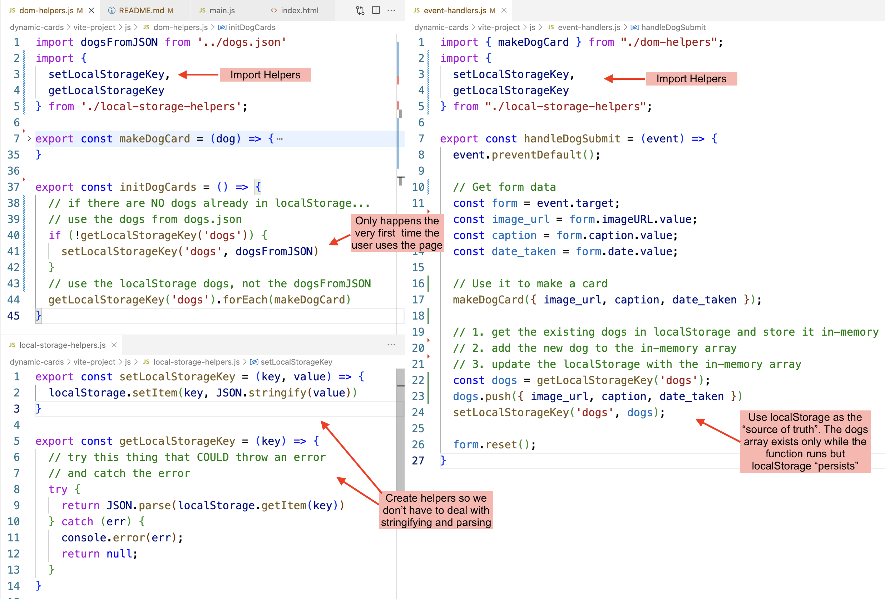

# Dog Cards

- [Part 0: Generate a list of dog data using ChatGPT](#part-0-generate-a-list-of-dog-data-using-chatgpt)
- [Part 1: Dynamically Generate a List of Cards from a JSON file](#part-1-dynamically-generate-a-list-of-cards-from-a-json-file)
- [Part 2: Build a Form to Add New Cards](#part-2-build-a-form-to-add-new-cards)
- [Part 3: Organize Into Modules](#part-3-organize-into-modules)
- [Part 4: Local Storage](#part-4-local-storage)

## Part 0: Generate a list of dog data using ChatGPT
1. Use ChatGPT to generate a JSON file with data using the prompt:

> "make me a json dataset for pictures of dogs. each picture should have an image URL, a caption, and a date taken"

## Part 1: Dynamically Generate a List of Cards from a JSON file
1. [DONE] create a container HTML to hold my "cards"
2. [DONE] figure out how to create a single "card" dynamically (using hard-coded data)
3. [DONE] create the cards using my array of data
4. [DONE] style

## Part 2: Build a Form to Add New Cards

1. [DONE] Create the form in HTML
2. [DONE] Add an event listener to collect data from the form
3. [DONE] use the data to generate a new card using the `makeDogCard` helper function

**Form Review**

What is the meaning/purpose of the attributes of a `form`, `label`, and `input`?
* Form:
  * `aria-labelledby` - for accessibility, refers to the id of an element that labels the form
* Label
  * labels increase the clickable size of an input
  * `for` - links the label to the input that has the matching id
* Input
  * `type` - what kind of input you're using (radio, checkbox, textbox)
  * `id` - used to link to a label, css, to be targeted by JS query selector
  * `name` - used when getting user values from the input

**Form Submissions**

* Who/what invokes the `handleSubmit` function?
* Who/what creates the `event` object?
  * `addEventListener` invokes `handleSubmit` and provides the `event` object

## Part 3: Organize Into Modules



## Part 4: Local Storage




```js
// local-storage-helpers.js
export const setLocalStorageKey = (key, value) => {
  localStorage.setItem(key, JSON.stringify(value))
}

export const getLocalStorageKey = (key) => {
  // try this thing that COULD throw an error
  // and catch the error
  try {
    return JSON.parse(localStorage.getItem(key))
  } catch (err) {
    console.error(err);
    return null;
  }
}
```

```js
// dom-helpers.js
import dogsFromJSON from '../dogs.json'
import {
  setLocalStorageKey,
  getLocalStorageKey
} from './local-storage-helpers';

export const makeDogCard = (dog) => {/* ... */}

export const initDogCards = () => {
  // if there are NO dogs already in localStorage...
  // use the dogs from dogs.json
  if (!getLocalStorageKey('dogs')) {
    setLocalStorageKey('dogs', dogsFromJSON)
  }
  // use the localStorage dogs, not the dogsFromJSON
  getLocalStorageKey('dogs').forEach(makeDogCard)
}
```

```js
// event-handlers.js
import { makeDogCard } from "./dom-helpers";
import {
  setLocalStorageKey,
  getLocalStorageKey
} from "./local-storage-helpers";

export const handleDogSubmit = (event) => {
  event.preventDefault();

  // Get form data
  const form = event.target;
  const image_url = form.imageURL.value;
  const caption = form.caption.value;
  const date_taken = form.date.value;

  // Use it to make a card
  makeDogCard({ image_url, caption, date_taken });

  // 1. get the existing dogs in localStorage and store it in-memory
  // 2. add the new dog to the in-memory array
  // 3. update the localStorage with the in-memory array
  const dogs = getLocalStorageKey('dogs');
  dogs.push({ image_url, caption, date_taken })
  setLocalStorageKey('dogs', dogs);

  form.reset();
}
```